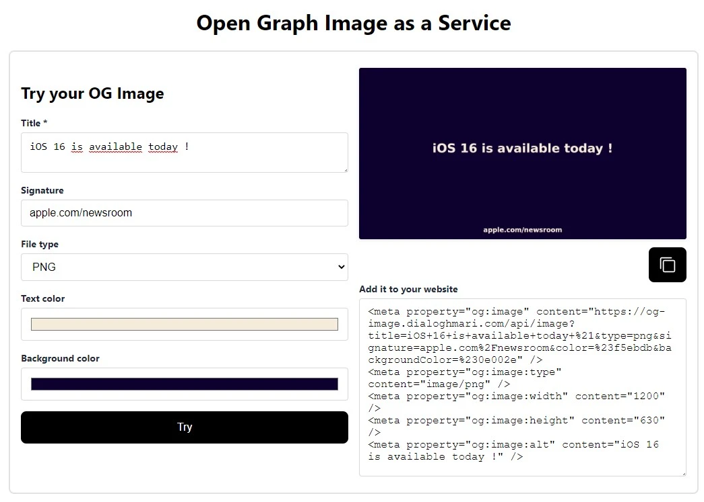

## Open Graph Image as a Service

Serverless service that generates dynamic Open Graph images that you can embed in your `<meta>` tags.
Inspired by [Vercel's project](https://github.com/vercel/og-image) and based on canvas.

